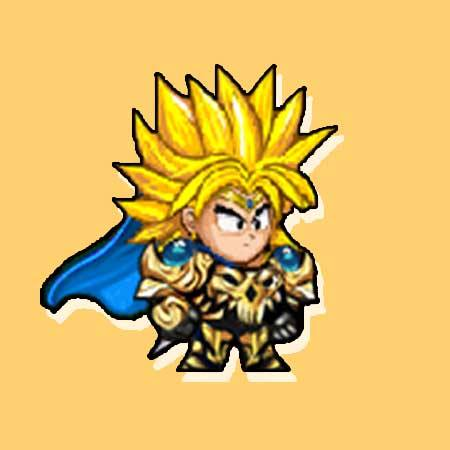

# Đây là 1 trang web tĩnh lấy ý tưởng làm về súc dịch vụ và các sự kiện của các loại game.
```html
<html lang="en">

<head>
    <meta charset="UTF-8">
    <meta name="viewport" content="width=device-width, initial-scale=1.0">
    <title>shop game 360</title>
    <link rel="StyleSheet" href="./css/style.css">

    <script src="https://ajax.googleapis.com/ajax/libs/jquery/2.1.1/jquery.min.js"></script>

</head>

<body>
    
    <nav>
        <ul>
            <li><a href="#" class="home" data-section="home">TRANG CHỦ</a></li>
            <li><a href="#" class="services" data-section="services">THÔNG BÁO</a></li>
            <li class="dropdown">
                <a href="javascript:void(0)" class="dropbtn">DỊCH VỤ</a>
                <div class="dropdown-content">
                    <a data-section="link1">Bán Xu</a>
                    <a data-section="link2">Làm Nhiệm Vụ</a>
                    
                </div>
            </li>
            <li class="work" style="position: relative;float-right;"><a id="uses" style="margin-top: 7px;padding: 7px;border-radius: 25px;border: 1px solid #686868;border-color: rgba(47, 53, 59, 0.4);" href="">ĐĂNG NHẬP</a></li>
            <li class="work"style="position: relative;float-right;"><a id="uses" style="margin-top:7px ;padding: 7px;border-radius: 25px;border: 1px solid #686868;border-color: rgba(47, 53, 59, 0.4);" href="">ĐĂNG KÝ</a></li>
            
        </ul>
    </nav>

    
    <header>
        <h1>SHOP GAME 360</h1>
        <h3>Xin chào cáo bạn!!!</h3>
        <ul>
        <li id="toppp" style="float:right"><p id="topp">Hotline:<a href="#" id="sdt">0979.304.808 </a> Mr.Nghĩa(8-22h)</p></li>
        </ul>
    </header>

    <section id="home" class="hideable-section">
        <div class="content1">
            <div class="container1">
                <h1>dịch vụ nso</h1>
                <div>
            <a href=""></a>		
                    <p>nạp thẻ</p>
                </div>   	 	
             <div>
            <a href=""></a>		
                    <p>up thuê</p>
                </div>   	 	
             <div>
            <a href=""></a>		
                    <p>bán xu tự động</p>
                </div>   	
             <div>
            <a href=""></a>	
                    <p>làm nhiệm vụ chính tuyến</p>
                </div>
            </div>
       </div>
       <div class="game">
        <div class="container">
       <h1>các thể loại game</h1>
       <div class="b" >
        <div class="column" id="a" >
             <a href=""></a>	
              <h2> <a href="">ninja school online</a> </h2>
              <p>Số tài khoản :</p>
              <p>Đã bán</p>
              <a href="" id="x" class="x">xem tất cả</a>
        </div>
        </div>
        <div class="b" >
            <div class="column" id="a" >
                 <a href=""></a>	
                  <h2> <a href="">liên quân mobile</a> </h2>
                  <p>Số tài khoản :</p>
                  <p>Đã bán</p>
                  <a href="" id="x" class="x">xem tất cả</a>
            </div>
            </div>
            <div class="b" >
                <div class="column" id="a" >
                     <a href=""></a>	
                      <h2> <a href="">làng lá phiêu lưu ký</a> </h2>
                      <p>Số tài khoản :</p>
                      <p>Đã bán</p>
                      <a href="" id="x" class="x">xem tất cả</a>
                </div>
                </div>   
                <div class="b" >
                    <div class="column" id="a" >
                         <a href=""></a>	
                          <h2> <a href="">ngọc rồng online</a> </h2>
                          <p>Số tài khoản :</p>
                          <p>Đã bán</p>
                          <a href="" id="x" class="x">xem tất cả</a>
                    </div>
                    </div>                 		

       </div>
       </div>
      


       </div>

       <div class="history">
        <div class="container">
           <h3>lịch sử giao dịch</h3>
        </div>
     </div>
  
     <div class="support-sp">
        <div class="container">
          <h1>LIÊN HỆ VỚI CHÚNG TÔI</h1>
           <div class="left">
              <h3>HotLine</h3>
              <a href="">0979.304.808</a>
              <p>8:00-22:00</p>
           </div>     
           <div class="left">
              <h3>Mail</h3>
              <a href="">NGHIA@gmail.com</a>
              <p>24 X 7 online support</p>
           </div>      
           <div class="left">
              <h3>Social</h3>
              <a href="">0979.304.808</a>
              <p>8:00-22:00</p>
           </div>
        </div>
     </div>
  
     <div class="copyright">
        <div class="container">
           <p>Bản quyền 2020 ShopGame</p>
        </div>
     </div>
    </section>

    <section id="services" class="hideable-section">
        <div>
        <div class="container">
              <div class="thongbao" >
                <a href="#" title="Mr. White" style="color: #FF4444;">Mr. White - Admin</a>
                <br></br>
                <b style="color: #1E5B7E;">Sự Kiện Halloween </b>
                <b>I. Thời gian</b>
                <br>
                <br>
                - Sau bảo trì chiều ngày 29/10 đến hết ngày 27/11/2020.
                <br>
                <br>
                <b>II. Nội dung</b>
                <br>
                <br>
                <b style="color:blue">1) Kẹo Táo</b>
                <br>
                <br>
                 - Trong thời gian diễn ra sự kiện tiêu diệt quái các bạn sẽ có cơ hội nhận được Quả Táo và Mật Ong.
                 <br>
                 <br>
                 - Mang 2 vật phẩm này tới gặp NPC Tiên nữ sẽ làm được Kẹo Táo với chi phí 20.000xu.
                <br>
                <br>
                - Sử dụng Kẹo táo sẽ nhận được phần thưởng kinh nghiệm vào có cơ hội nhận thêm một phần quà may mắn.
                <br>
                <br>
                <b style="color:blue">2) Hộp Ma Quỷ</b>
                <br>
                <br>
                - Trong thời gian diễn ra sự kiện tiêu diệt quái các bạn sẽ có cơ hội nhận được Xương Thú và Tàn Linh.
                <br>
                <br>
                - Các bạn có thể tới gặp NPC Tiên nữ để làm Hộp ma quỷ với các nguyên liệu Xương Thú, Tàn Linh và Ma vật.
                <br>
                <br>
                - Hộp Ma Quỷ chứ được phần thưởng kinh nghiệm và một phần quà may mắn, may mắn hơn trong lúc sử dụng Hộp Ma Quỷ sẽ xuất hiện Hắc Long. Chỉ người sử dụng mới nhìn thấy được Hắc Long. Tiêu diệt Hắc Long sẽ nhận thêm phần thưởng khác.
                <br>
                <br>
                <b style="color:blue">3) Bí Ma</b>
                <br>
                <br>
                - Trong thời gian diễn  ra sự kiện vào khoảng thời gian 18h đến 24h mỗi ngày tại Vùng Đất Ma Quỷ sẽ xuất hiện lời nguyền ma quỷ. 

                <br>
                <br>
                <b>III. Lưu ý</b>
                - Hết sự kiện vật phẩm sự kiện sẽ không sử dụng được nữa.
                - Đánh quái cấp độ &gt; 40 sẽ rơi ra vật phẩm sự kiện.
                - Rất nhiều phần quà giá trị đang chờ đợi các bạn như các loại thú cưỡi, xe máy, Bát bảo, Rương Bạch Ngân, Rương Huyền Bí...
                <br>
                <br>
                

              </div>

          </div>
        </div>
          
    </section>

    <section id="about" class="hideable-section">
        <div>About content</div>
    </section>

    <section id="link1" class="hideable-section">
        <div style="line-height: 1.42857;">
           <center><h1 style="color: #3f444a;">DỊCH VỤ NẠP XU</h1></center>
            <div class="column1">
                
            <center>
            </div>
            <div class="column1">
                <label  for="cars" >Chọn sever mua xu:</label>
                <select name="serverxu" id="serverxu" class="soxu">
                  
                    <option value="volvo">tensen</option>
                    <option value="saab">kunia</option>
                    <option value="mercedes">Mercedes</option>
                    <option value="audi">bokken</option>
                  
                </select>
                <div class="column1" >
                    
                    <span style="font-size: 14px;">Số tiền thanh toán phải từ <b style="font-weight:bold;">1,000đ</b>  đến <b style="font-weight:bold;">10,000,000đ</b> </span>
                    <input autofocus="" value="1000" class="soxu " id="input_pack" type="text" placeholder="Số tiền">                
                </div>
                <br><br>
                
                <input class="muaxu" type="submit" value="NẠP XU">
                </center>
            </div>
        </div>
    </section>

    <section id="link2" class="hideable-section">
        <div>
            <div class="column1">
                

            </div>
            <div class="column2">
                <p>
<input value="0" type="checkbox" id="0">
<label for="0">Treo 10 ngày - 10,000 VNĐ</label>
</p>
                <p>
<input value="1" type="checkbox" id="1">
<label for="1">Treo 30 ngày - 35,000 VNĐ</label>
</p>
                <p>
<input value="2" type="checkbox" id="2">
<label for="2">Treo 60 ngày - 65,000 VNĐ</label>
</p>
            </div>
            <input class="muaxu" type="submit" value="Treo ngay">
        </div>
    </section>
     </div>
     </div>
     
    <script>
        $(function() {
            $('nav ul li a').click(function() {
                // Lấy section để hiển thị
                var $section = $('#' + $(this).data('section'));

                // Nếu đang hiện thì không làm gì.
                // Nếu không, ẩn tất cả các se cho hiện (kiểu fade in) phần mong muốn.
                if (!$section.is(':visible')) {
                    $('.hideable-section').hide();
                    $section.fadeIn();
                }
            });
        });
    </script>
</body>

</html>
```
